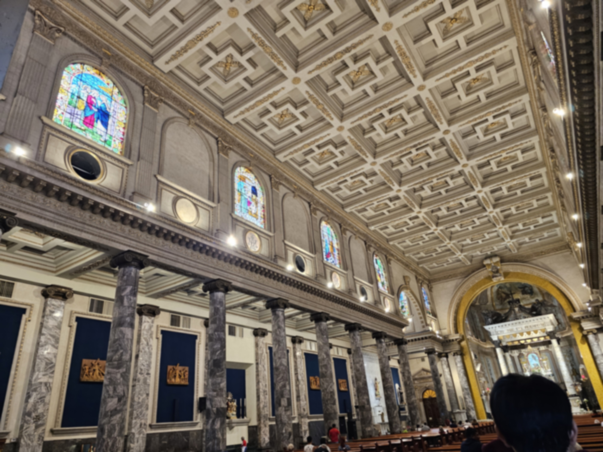

# Filtros Paralelos en Imágenes

## Descripción del Proyecto
Este proyecto tiene como objetivo demostrar el uso de la **programación paralela** mediante la aplicación de múltiples filtros a un conjunto de imágenes. Utilizando técnicas de paralelismo (fino y grueso), se busca optimizar el procesamiento de imágenes, comparando los resultados y el rendimiento entre versiones secuenciales y paralelas.

## Características
- **Filtros Implementados**:
  - Escalado a niveles de gris.
  - Detección de bordes (filtro Sobel).
  - Suavizado (filtro Gaussiano).
- **Paralelismo**:
  - Paralelismo grueso: procesar imágenes completas por proceso.
  - Paralelismo fino: dividir cada imagen en bloques y aplicar filtros en paralelo.
- **Manejo de Memoria y Excepciones**:
  - Evitar problemas de concurrencia en acceso a memoria compartida.
  - Manejo de errores en procesos.

## Objetivos
1. Mostrar los beneficios de la programación paralela en el procesamiento de imágenes.
2. Comparar tiempos de ejecución entre las versiones secuenciales y paralelas.
3. Evaluar el **speedup** y la **eficiencia** del sistema.

## Tecnologías Utilizadas
- **Lenguaje**: Python 3.8+
- **Bibliotecas**:
  - `opencv-python`: Para el procesamiento de imágenes.
  - `multiprocessing`: Para la implementación de paralelismo.
  - `numpy`: Para operaciones matemáticas y de matrices.

## Requisitos del Sistema
1. Tener instalado Python 3.8 o superior.
2. Instalar las dependencias necesarias:
   ```bash
   pip install opencv-python numpy

## Ejecución del Proyecto
1. Clonar el repositorio:
   ```bash
   git clone https://github.com/BryanCetzal/EfectosImagenes.git
   cd EfectosImagenes
2. Agregar imagenes a la carpeta de images
3. Ejecutar el script
   ```bash
   python paralelismo.py

## Resultados Esperados
- Imagenes procesadas:
  -Las imagenes procesadas se guardaran en la carpeta `output`
- Medición del rendimiento:
  - El script imprimirá tiempos de ejecución secuenciales y paralelos.
  - Se calculará y mostrará el speedup y la eficiencia.
 
## Ejemplo de uso
Input: 
  

Output:  
<div align="center">

 </div>

## Resultados de Rendimiento

| Número de Procesos | Tiempo Secuencial (s) | Tiempo Paralelo (s) | Speedup |
|---------------------|-----------------------|----------------------|---------|
| 1                   | 30.59                | 30.78               | 0.99    |
| 2                   | 30.74                | 18.20               | 1.69    |
| 4                   | 31.22                | 11.35               | 2.75    |
| 6                   | 30.57                | 10.59               | 2.89    |
| 8                   | 30.62                | 9.81                | 3.12    |

**Nota:** Se usaron 40 imagenes para estas pruebas, con una resolución de entre 2000x8000.

Paricipantes: 
- [Bryan Emmanuel Cetzal Ceme](https://github.com/BryanCetzal/)
- [Emir Alejandro Bellos Cruz](https://github.com/EmirBellos)
